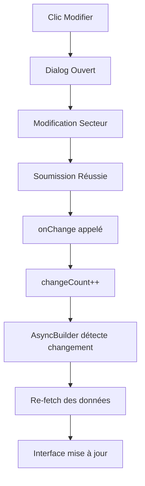

# 🐛 Correction du Bug - Page de Détails des Secteurs

## 📋 **Problème Identifié**

Sur la page de détails des secteurs dans l'administration (`/management/secteurs/[id]`), les informations du secteur ne se mettaient pas à jour après modification.

## 🔍 **Analyse du Bug**

### **Symptômes**
- Après modification d'un secteur via le dialog, les informations affichées (titre, libellé) restaient inchangées
- L'utilisateur devait rafraîchir manuellement la page pour voir les changements

### **Cause Racine**
Le composant `AsyncBuilder` n'était pas informé que les données avaient changé après la modification. Le mécanisme de re-fetch n'était pas déclenché.

### **Code Problématique**
```typescript
// AVANT - Manquait callDataListen
return <AsyncBuilder
    promise={async () => {
        return HttpService.show<Sector>({
            url: `/sectors/${id}`,
            fromJson: (json: any) => Sector.fromJSON(json)
        });
    }}
    loadingComponent={<LoadingSpinner color="#0F766E" />}
    hasData={(data) => {
        // ...
    }}
/>
```

## ✅ **Solution Appliquée**

### **Corrections Implémentées**

1. **Ajout du prop `callDataListen`**
```typescript
// APRÈS - Avec callDataListen
return <AsyncBuilder
    promise={async () => {
        return HttpService.show<Sector>({
            url: `/sectors/${id}`,
            fromJson: (json: any) => Sector.fromJSON(json)
        });
    }}
    callDataListen={changeCount}  // ✅ AJOUTÉ
    loadingComponent={<LoadingSpinner color="#0F766E" />}
    hasData={(data) => {
        // ...
    }}
/>
```

2. **Amélioration du contrôle du Dialog**
```typescript
// AVANT - Dialog non contrôlé
<Dialog>
    <DialogTrigger>
        <Button>...</Button>
    </DialogTrigger>
    <DialogContent>...</DialogContent>
</Dialog>

// APRÈS - Dialog contrôlé
<Dialog open={open} onOpenChange={setOpen}>
    <DialogTrigger>
        <Button>...</Button>
    </DialogTrigger>
    <DialogContent>...</DialogContent>
</Dialog>
```

## 🔧 **Comment ça Fonctionne**

### **Mécanisme de Mise à Jour**
1. L'utilisateur clique sur "Modifier" → Dialog s'ouvre
2. L'utilisateur modifie le secteur → Soumission du formulaire
3. `AddSectors` appelle `onChange(state)` si succès
4. `onChange` incrémente `changeCount` et ferme le dialog
5. `AsyncBuilder` détecte le changement de `changeCount` via `callDataListen`
6. `AsyncBuilder` re-exécute la promise et rafraîchit les données
7. L'interface se met à jour automatiquement

### **Cycle de Vie**


## 🧪 **Tests de Validation**

### **Scénarios à Tester**
1. **Test Principal**
   - ✅ Ouvrir la page de détails d'un secteur
   - ✅ Cliquer sur "Modifier"
   - ✅ Changer le libellé du secteur
   - ✅ Sauvegarder
   - ✅ Vérifier que le titre de la page se met à jour immédiatement

2. **Tests Complémentaires**
   - ✅ Vérifier que le breadcrumb se met à jour
   - ✅ Vérifier que la fermeture du dialog fonctionne
   - ✅ Tester l'annulation de modification
   - ✅ Tester avec une erreur de validation

## 📁 **Fichiers Modifiés**

- `src/app/(admin)/management/secteurs/[id]/page.tsx`
  - Ajout de `callDataListen={changeCount}`
  - Ajout de `open={open} onOpenChange={setOpen}` au Dialog

## 🔄 **Pattern Général**

Cette correction illustre un pattern important pour les composants utilisant `AsyncBuilder` :

```typescript
// Pattern à suivre pour les mises à jour automatiques
const [changeCount, setChangeCount] = useState(0);

// Dans AsyncBuilder
<AsyncBuilder
    promise={() => fetchData()}
    callDataListen={changeCount}  // Déclenche re-fetch
    hasData={(data) => (
        <ComponentWithModification
            data={data}
            onDataChange={() => setChangeCount(c => c + 1)}  // Incrémente compteur
        />
    )}
/>
```

## 💡 **Bonnes Pratiques**

### **✅ À Faire**
- Toujours utiliser `callDataListen` avec `AsyncBuilder` pour les données modifiables
- Contrôler les Dialogs avec `open` et `onOpenChange`
- Incrémenter un compteur ou changer une valeur pour déclencher le re-fetch
- Tester les mises à jour en temps réel

### **❌ À Éviter**
- Oublier `callDataListen` sur des données qui peuvent changer
- Laisser les Dialogs non contrôlés
- Forcer l'utilisateur à rafraîchir manuellement la page
- Utiliser des solutions complexes comme forceUpdate()

## 🚀 **Impact**

### **Avant la Correction**
- ❌ UX dégradée (rafraîchissement manuel requis)
- ❌ Confusion utilisateur (changements non visibles)
- ❌ Perte de confiance dans l'interface

### **Après la Correction**  
- ✅ Mise à jour en temps réel
- ✅ UX fluide et naturelle
- ✅ Interface cohérente et fiable

## 🔮 **Amélioration Future**

Considérer l'implémentation d'un système de cache global ou d'état partagé (comme React Query) pour éviter ce genre de problème à l'échelle de l'application.