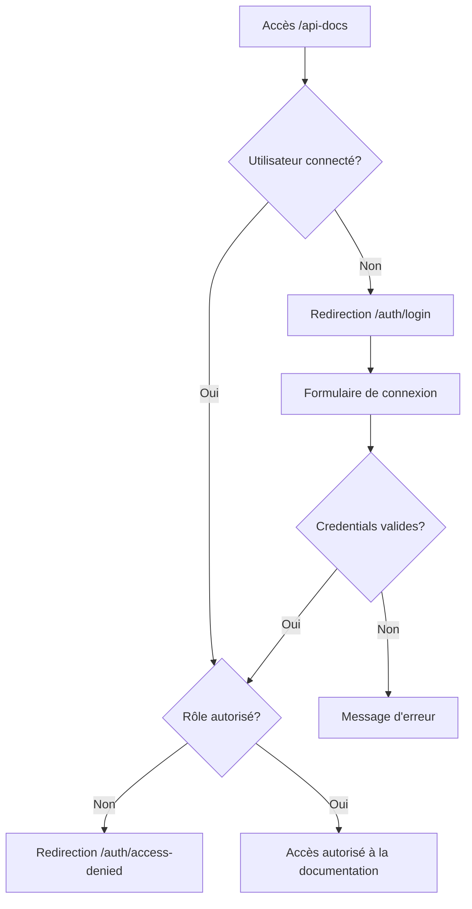

# Sécurité de la Documentation API

## 🔒 Protection de l'accès

La documentation API (`/api-docs`) et l'endpoint Swagger (`/api/swagger`) sont maintenant protégés par un système d'authentification robuste pour garantir un accès sécurisé aux ressources internes.

## 🛡️ Système de sécurité

### Authentification requise
- **JWT Token** : Utilisation de tokens JWT stockés dans des cookies HTTP-only
- **Vérification de session** : Validation de l'utilisateur en base de données
- **Expiration automatique** : Tokens avec durée de vie limitée

### Contrôle d'accès basé sur les rôles (RBAC)
Les rôles suivants ont accès à la documentation API :
- `admin` - Administrateur principal
- `super_admin` - Super administrateur
- `developer` - Développeur
- `internal` - Personnel interne autorisé

## 🌐 Routes protégées

### Pages protégées :
- `/api-docs` - Interface Swagger UI
- `/api-docs/*` - Toutes les sous-pages

### API protégées :
- `/api/swagger` - Spécification OpenAPI JSON

## 🔐 Processus d'authentification

### 1. Accès non autorisé
```
Utilisateur non connecté → Redirection vers /auth/login
```

### 2. Privilèges insuffisants
```
Utilisateur connecté mais rôle inadéquat → Redirection vers /auth/access-denied
```

### 3. Accès autorisé
```
Utilisateur connecté + rôle autorisé → Accès à la documentation
```

## 📱 Pages d'authentification

### Page de connexion (`/auth/login`)
- Formulaire de connexion sécurisé
- Redirection automatique après connexion
- Messages d'erreur appropriés
- Design responsive

### Page d'accès refusé (`/auth/access-denied`)
- Information sur les privilèges requis
- Détails du compte utilisateur
- Options de contact pour demander l'accès

## 🔧 Composants techniques

### Hooks personnalisés
- `useAuth()` - Gestion de l'état d'authentification
- Vérification automatique des permissions
- Gestion de la déconnexion

### Middleware Next.js
- Protection automatique des routes
- Vérification JWT côté serveur
- Gestion des erreurs d'authentification

### Utilitaires d'authentification
- `auth-middleware.ts` - Fonctions de vérification
- `session.ts` - Gestion des cookies de session
- `jwt.ts` - Gestion des tokens JWT

## 🚀 Interface utilisateur sécurisée

### En-tête authentifié
La documentation affiche maintenant :
- Nom de l'utilisateur connecté
- Rôle de l'utilisateur
- Bouton de déconnexion
- Indicateur d'accès sécurisé

### Fonctionnalités de sécurité
- Déconnexion automatique en cas de token expiré
- Vérification en temps réel des permissions
- Messages d'erreur informatifs

## 📋 Configuration requise

### Variables d'environnement
```env
JWT_SECRET=your-secret-key
REFRESH_SECRET=your-refresh-secret
NEXT_PUBLIC_APP_URL=http://localhost:3000
```

### Rôles utilisateurs en base
Assurez-vous que les utilisateurs ont les rôles appropriés :
```sql
UPDATE users SET role = 'developer' WHERE email = 'dev@industriellerh.ca';
UPDATE users SET role = 'admin' WHERE email = 'admin@industriellerh.ca';
```

## 🔄 Flux d'authentification



## 🛠️ Maintenance et monitoring

### Logs de sécurité
- Tentatives d'accès non autorisées
- Échecs d'authentification
- Erreurs de token JWT

### Surveillance recommandée
- Nombre de connexions par utilisateur
- Tentatives d'accès avec tokens expirés
- Accès depuis des IP inhabituelles

## 📞 Support

Pour les questions de sécurité ou demandes d'accès :
- **Email technique** : tech@industriellerh.ca
- **Email sécurité** : security@industriellerh.ca

## 🔍 Audit de sécurité

### Points de contrôle
- ✅ Authentification obligatoire
- ✅ Contrôle d'accès basé sur les rôles
- ✅ Tokens JWT sécurisés
- ✅ Cookies HTTP-only
- ✅ Middleware de protection
- ✅ Pages d'erreur informatives
- ✅ Déconnexion sécurisée

### Recommandations de sécurité
1. **Rotation régulière des secrets JWT**
2. **Audit des rôles utilisateurs**
3. **Surveillance des logs d'accès**
4. **Tests de pénétration périodiques**
5. **Formation du personnel sur la sécurité**

---

**Industrielle RH** - Sécurité et confidentialité avant tout 🛡️